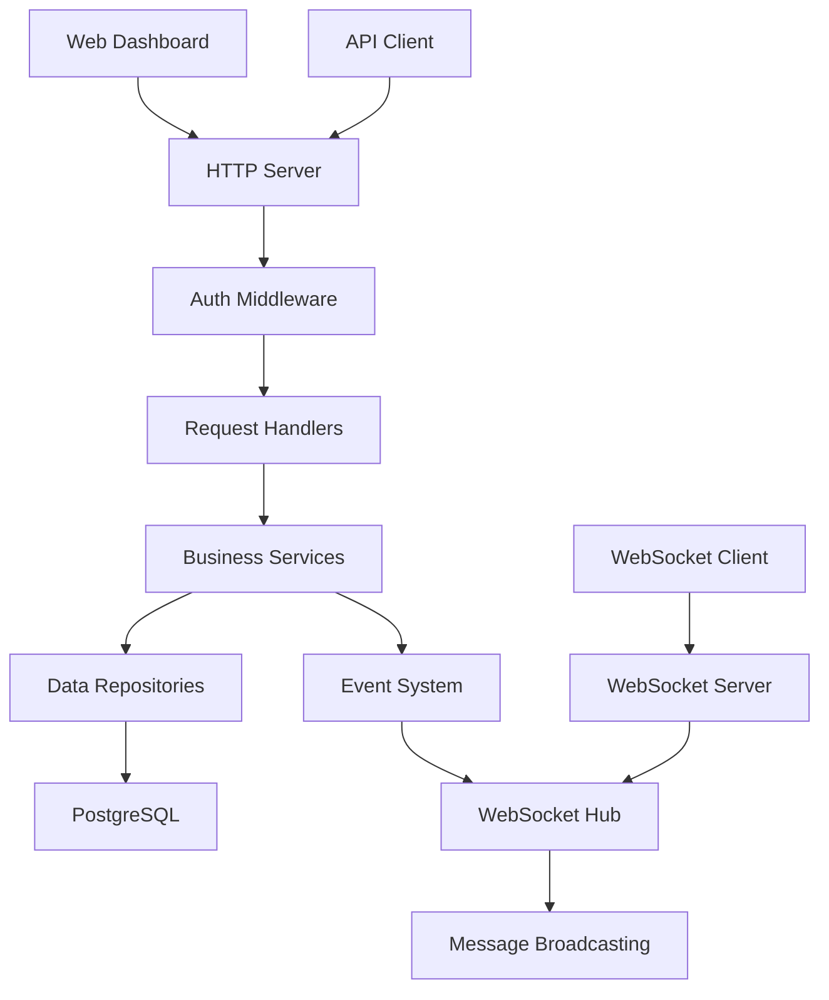

# DriftMgr Development Guide

This guide covers the development workflow, architecture, and best practices for contributing to DriftMgr.

## 📋 Table of Contents

- [Getting Started](#getting-started)
- [Project Structure](#project-structure)
- [Development Environment](#development-environment)
- [Architecture Overview](#architecture-overview)
- [Code Style & Standards](#code-style--standards)
- [Testing](#testing)
- [Building & Running](#building--running)
- [Contributing](#contributing)
- [Debugging](#debugging)
- [Performance Optimization](#performance-optimization)

## 🚀 Getting Started

### Prerequisites

- **Go**: 1.21 or later
- **Node.js**: 18 or later (for web dashboard)
- **PostgreSQL**: 13 or later
- **Git**: Latest version
- **Docker**: 20.10+ (optional)

### Quick Setup

```bash
# Clone the repository
git clone https://github.com/catherinevee/driftmgr.git
cd driftmgr

# Install Go dependencies
go mod download

# Install Node.js dependencies (for web dashboard)
cd web/dashboard
npm install
cd ../..

# Set up development database
createdb driftmgr_dev

# Run the application
go run ./cmd/server --port 8080 --host 0.0.0.0
```

## 📁 Project Structure

```
driftmgr/
├── cmd/                          # Application entry points
│   └── server/                   # Main server application
│       ├── main.go              # Server entry point
│       └── ...
├── internal/                     # Private application code
│   ├── api/                     # API layer
│   │   ├── server.go           # HTTP server implementation
│   │   ├── handlers.go         # Request handlers
│   │   ├── middleware.go       # HTTP middleware
│   │   ├── types.go           # API types and responses
│   │   └── ...
│   ├── auth/                   # Authentication service
│   │   ├── service.go         # Auth business logic
│   │   ├── jwt.go            # JWT token handling
│   │   ├── password.go       # Password hashing
│   │   ├── middleware.go     # Auth middleware
│   │   ├── models.go         # Auth data models
│   │   └── ...
│   ├── websocket/             # WebSocket service
│   │   ├── service.go        # WebSocket service
│   │   ├── hub.go           # Connection hub
│   │   ├── client.go        # WebSocket client
│   │   ├── handlers.go      # WebSocket handlers
│   │   └── ...
│   ├── models/               # Data models
│   │   ├── common.go        # Common types
│   │   ├── resources.go     # Resource models
│   │   ├── state.go         # State models
│   │   ├── drift.go         # Drift models
│   │   └── ...
│   ├── config/              # Configuration management
│   │   └── config.go       # Config loading and validation
│   └── ...
├── web/                      # Web dashboard
│   ├── dashboard/           # Main dashboard
│   │   ├── index.html      # Dashboard HTML
│   │   ├── js/            # JavaScript files
│   │   ├── css/           # Stylesheets
│   │   └── ...
│   └── login/              # Login page
│       ├── index.html     # Login HTML
│       └── ...
├── docs/                    # Documentation
│   ├── README.md          # Main documentation
│   ├── API.md            # API documentation
│   ├── DEPLOYMENT.md     # Deployment guide
│   └── ...
├── scripts/               # Build and utility scripts
│   ├── build.sh         # Build script
│   ├── test.sh          # Test script
│   └── ...
├── tests/                # Test files
│   ├── e2e_test.go      # End-to-end tests
│   ├── performance_test.go # Performance tests
│   └── ...
├── go.mod               # Go module definition
├── go.sum              # Go module checksums
├── Makefile           # Build automation
└── README.md         # Project overview
```

## 🛠️ Development Environment

### IDE Setup

#### VS Code

Install the following extensions:
- Go (Google)
- REST Client
- Thunder Client
- GitLens

Create `.vscode/settings.json`:
```json
{
  "go.toolsManagement.checkForUpdates": "local",
  "go.useLanguageServer": true,
  "go.formatTool": "goimports",
  "go.lintTool": "golangci-lint",
  "go.testFlags": ["-v"],
  "go.buildTags": "dev",
  "editor.formatOnSave": true,
  "editor.codeActionsOnSave": {
    "source.organizeImports": true
  }
}
```

#### GoLand/IntelliJ

1. Install Go plugin
2. Configure Go SDK
3. Enable Go modules
4. Set up code formatting

### Environment Variables

Create `.env` file for development:
```bash
# Database
DRIFTMGR_DB_HOST=localhost
DRIFTMGR_DB_PORT=5432
DRIFTMGR_DB_NAME=driftmgr_dev
DRIFTMGR_DB_USER=driftmgr
DRIFTMGR_DB_PASSWORD=dev-password

# Server
DRIFTMGR_HOST=0.0.0.0
DRIFTMGR_PORT=8080
DRIFTMGR_LOG_LEVEL=debug

# Authentication
DRIFTMGR_JWT_SECRET=dev-jwt-secret-key
DRIFTMGR_JWT_ISSUER=driftmgr-dev
DRIFTMGR_JWT_AUDIENCE=driftmgr-api-dev

# Features
DRIFTMGR_AUTH_ENABLED=true
DRIFTMGR_CORS_ENABLED=true
DRIFTMGR_RATE_LIMIT_ENABLED=false
```

### Database Setup

```bash
# Create development database
createdb driftmgr_dev

# Run migrations (when available)
go run ./cmd/server --migrate

# Seed test data (when available)
go run ./cmd/server --seed
```

### Hot Reload

For development with hot reload:

```bash
# Install air for hot reloading
go install github.com/cosmtrek/air@latest

# Create .air.toml configuration
cat > .air.toml << EOF
root = "."
testdata_dir = "testdata"
tmp_dir = "tmp"

[build]
  args_bin = ["--port", "8080", "--host", "0.0.0.0"]
  bin = "./tmp/main"
  cmd = "go build -o ./tmp/main ./cmd/server"
  delay = 1000
  exclude_dir = ["assets", "tmp", "vendor", "testdata", "web"]
  exclude_file = []
  exclude_regex = ["_test.go"]
  exclude_unchanged = false
  follow_symlink = false
  full_bin = ""
  include_dir = []
  include_ext = ["go", "tpl", "tmpl", "html"]
  include_file = []
  kill_delay = "0s"
  log = "build-errors.log"
  poll = false
  poll_interval = 0
  rerun = false
  rerun_delay = 500
  send_interrupt = false
  stop_on_root = false

[color]
  app = ""
  build = "yellow"
  main = "magenta"
  runner = "green"
  watcher = "cyan"

[log]
  main_only = false
  time = false

[misc]
  clean_on_exit = false

[screen]
  clear_on_rebuild = false
  keep_scroll = true
EOF

# Run with hot reload
air
```

## 🏗️ Architecture Overview

### High-Level Architecture

```
┌─────────────────┐    ┌─────────────────┐    ┌─────────────────┐
│   Web Dashboard │    │   REST API      │    │  WebSocket API  │
│                 │    │                 │    │                 │
│  - HTML/CSS/JS  │    │  - HTTP Server  │    │  - Real-time    │
│  - Forms        │    │  - Handlers     │    │  - Notifications│
│  - Charts       │    │  - Middleware   │    │  - Updates      │
└─────────────────┘    └─────────────────┘    └─────────────────┘
         │                       │                       │
         └───────────────────────┼───────────────────────┘
                                 │
                    ┌─────────────────┐
                    │  Business Logic │
                    │                 │
                    │  - Auth Service │
                    │  - WebSocket    │
                    │  - Models       │
                    │  - Config       │
                    └─────────────────┘
                                 │
                    ┌─────────────────┐
                    │   Data Layer    │
                    │                 │
                    │  - PostgreSQL   │
                    │  - Repositories │
                    │  - Migrations   │
                    └─────────────────┘
```

### Component Interactions



### Data Flow

1. **Request Processing**:
   - HTTP request → Middleware → Handler → Service → Repository → Database
   - Response flows back through the same layers

2. **WebSocket Communication**:
   - WebSocket connection → Hub → Client management
   - Events from services → Hub → Broadcast to clients

3. **Authentication Flow**:
   - Login request → Auth service → JWT generation
   - Protected requests → JWT validation → User context

## 📝 Code Style & Standards

### Go Code Style

#### Naming Conventions

```go
// Package names: lowercase, single word
package auth

// Types: PascalCase
type User struct {
    ID       string    `json:"id"`
    Username string    `json:"username"`
    Email    string    `json:"email"`
    CreatedAt time.Time `json:"created_at"`
}

// Functions: PascalCase for exported, camelCase for private
func NewUser(username, email string) *User { ... }
func (u *User) validate() error { ... }

// Variables: camelCase
var userCount int
var isAuthenticated bool

// Constants: PascalCase for exported, camelCase for private
const MaxRetries = 3
const defaultTimeout = 30 * time.Second
```

#### Error Handling

```go
// Always handle errors explicitly
user, err := getUserByID(id)
if err != nil {
    return fmt.Errorf("failed to get user: %w", err)
}

// Use custom error types for specific errors
type ValidationError struct {
    Field   string
    Message string
}

func (e ValidationError) Error() string {
    return fmt.Sprintf("validation error on field %s: %s", e.Field, e.Message)
}

// Wrap errors with context
if err := processUser(user); err != nil {
    return fmt.Errorf("failed to process user %s: %w", user.ID, err)
}
```

#### Struct Tags

```go
type User struct {
    ID        string    `json:"id" db:"id" validate:"required,uuid"`
    Username  string    `json:"username" db:"username" validate:"required,min=3,max=50"`
    Email     string    `json:"email" db:"email" validate:"required,email"`
    CreatedAt time.Time `json:"created_at" db:"created_at"`
    UpdatedAt time.Time `json:"updated_at" db:"updated_at"`
}
```

#### Interface Design

```go
// Keep interfaces small and focused
type UserRepository interface {
    GetByID(id string) (*User, error)
    GetByUsername(username string) (*User, error)
    Create(user *User) error
    Update(user *User) error
    Delete(id string) error
}

// Use interface composition
type UserService interface {
    UserRepository
    ValidateUser(user *User) error
    HashPassword(password string) (string, error)
}
```

### Documentation Standards

#### Package Documentation

```go
// Package auth provides authentication and authorization services.
//
// This package includes:
// - User management
// - JWT token handling
// - Password hashing
// - Role-based access control
//
// Example:
//   authService := auth.NewService(repo, jwtService, passwordService)
//   user, err := authService.Login(username, password)
package auth
```

#### Function Documentation

```go
// NewService creates a new authentication service with the provided dependencies.
//
// Parameters:
//   - userRepo: Repository for user data operations
//   - jwtService: Service for JWT token operations
//   - passwordService: Service for password hashing and verification
//
// Returns:
//   - *Service: Configured authentication service
//
// Example:
//   service := auth.NewService(userRepo, jwtService, passwordService)
func NewService(userRepo UserRepository, jwtService *JWTService, passwordService *PasswordService) *Service {
    // Implementation
}
```

#### Type Documentation

```go
// User represents a system user with authentication and profile information.
//
// Fields:
//   - ID: Unique identifier (UUID format)
//   - Username: Unique username for login
//   - Email: User's email address
//   - PasswordHash: Hashed password (never returned in JSON)
//   - IsActive: Whether the user account is active
//   - CreatedAt: Account creation timestamp
//   - UpdatedAt: Last update timestamp
type User struct {
    ID           string    `json:"id" db:"id" validate:"required,uuid"`
    Username     string    `json:"username" db:"username" validate:"required,min=3,max=50"`
    Email        string    `json:"email" db:"email" validate:"required,email"`
    PasswordHash string    `json:"-" db:"password_hash" validate:"required"`
    IsActive     bool      `json:"is_active" db:"is_active"`
    CreatedAt    time.Time `json:"created_at" db:"created_at"`
    UpdatedAt    time.Time `json:"updated_at" db:"updated_at"`
}
```

### Code Organization

#### File Organization

```go
// Each file should have a single responsibility
// auth/
//   ├── service.go      # Main business logic
//   ├── jwt.go         # JWT-specific functionality
//   ├── password.go    # Password handling
//   ├── middleware.go  # HTTP middleware
//   ├── models.go      # Data models
//   ├── repository.go  # Repository interfaces
//   └── memory_repository.go # In-memory implementation
```

#### Import Organization

```go
package auth

import (
    // Standard library imports
    "context"
    "fmt"
    "time"
    
    // Third-party imports
    "github.com/golang-jwt/jwt/v5"
    "github.com/google/uuid"
    
    // Local imports
    "github.com/catherinevee/driftmgr/internal/models"
)
```

## 🧪 Testing

### Test Structure

```go
// Test files should be named *_test.go
// auth/service_test.go

package auth

import (
    "testing"
    "time"
    
    "github.com/stretchr/testify/assert"
    "github.com/stretchr/testify/require"
)

func TestService_Login(t *testing.T) {
    // Arrange
    service := createTestService(t)
    user := createTestUser(t, "testuser", "test@example.com", "password123")
    
    // Act
    result, err := service.Login(&LoginRequest{
        Username: "testuser",
        Password: "password123",
    }, "test-agent", "127.0.0.1")
    
    // Assert
    require.NoError(t, err)
    assert.NotEmpty(t, result.AccessToken)
    assert.NotEmpty(t, result.RefreshToken)
    assert.Equal(t, "Bearer", result.TokenType)
}

func TestService_Login_InvalidCredentials(t *testing.T) {
    // Arrange
    service := createTestService(t)
    createTestUser(t, "testuser", "test@example.com", "password123")
    
    // Act
    result, err := service.Login(&LoginRequest{
        Username: "testuser",
        Password: "wrongpassword",
    }, "test-agent", "127.0.0.1")
    
    // Assert
    assert.Error(t, err)
    assert.Nil(t, result)
    assert.Contains(t, err.Error(), "invalid credentials")
}

// Helper functions
func createTestService(t *testing.T) *Service {
    // Implementation
}

func createTestUser(t *testing.T, username, email, password string) *User {
    // Implementation
}
```

### Test Categories

#### Unit Tests
```go
// Test individual functions and methods
func TestPasswordService_HashPassword(t *testing.T) {
    service := NewPasswordService()
    
    password := "testpassword123"
    hash, err := service.HashPassword(password)
    
    require.NoError(t, err)
    assert.NotEqual(t, password, hash)
    assert.True(t, len(hash) > 0)
}
```

#### Integration Tests
```go
// Test component interactions
func TestAuthService_Integration(t *testing.T) {
    // Test the full authentication flow
    service := createTestService(t)
    
    // Register user
    user, err := service.Register(&RegisterRequest{
        Username:  "testuser",
        Email:     "test@example.com",
        Password:  "password123",
        FirstName: "Test",
        LastName:  "User",
    })
    require.NoError(t, err)
    
    // Login user
    loginResult, err := service.Login(&LoginRequest{
        Username: "testuser",
        Password: "password123",
    }, "test-agent", "127.0.0.1")
    require.NoError(t, err)
    
    // Validate token
    claims, err := service.JWTService().ValidateToken(loginResult.AccessToken)
    require.NoError(t, err)
    assert.Equal(t, user.ID, claims.UserID)
}
```

#### End-to-End Tests
```go
// Test complete user workflows
func TestE2E_UserRegistrationAndLogin(t *testing.T) {
    // Start test server
    server := startTestServer(t)
    defer server.Close()
    
    // Register user
    registerResp := makeRequest(t, server.URL+"/api/v1/auth/register", "POST", RegisterRequest{
        Username:  "testuser",
        Email:     "test@example.com",
        Password:  "password123",
        FirstName: "Test",
        LastName:  "User",
    })
    assert.Equal(t, http.StatusCreated, registerResp.StatusCode)
    
    // Login user
    loginResp := makeRequest(t, server.URL+"/api/v1/auth/login", "POST", LoginRequest{
        Username: "testuser",
        Password: "password123",
    })
    assert.Equal(t, http.StatusOK, loginResp.StatusCode)
}
```

### Test Utilities

```go
// testutils.go
package testutils

import (
    "bytes"
    "encoding/json"
    "net/http"
    "testing"
)

func MakeRequest(t *testing.T, url, method string, body interface{}) *http.Response {
    var reqBody []byte
    if body != nil {
        var err error
        reqBody, err = json.Marshal(body)
        require.NoError(t, err)
    }
    
    req, err := http.NewRequest(method, url, bytes.NewBuffer(reqBody))
    require.NoError(t, err)
    
    req.Header.Set("Content-Type", "application/json")
    
    client := &http.Client{}
    resp, err := client.Do(req)
    require.NoError(t, err)
    
    return resp
}

func ParseResponse(t *testing.T, resp *http.Response, target interface{}) {
    defer resp.Body.Close()
    
    err := json.NewDecoder(resp.Body).Decode(target)
    require.NoError(t, err)
}
```

### Running Tests

```bash
# Run all tests
go test ./...

# Run tests with coverage
go test -cover ./...

# Run tests with verbose output
go test -v ./...

# Run specific test
go test -run TestService_Login ./internal/auth

# Run benchmarks
go test -bench=. ./...

# Run tests with race detection
go test -race ./...

# Generate coverage report
go test -coverprofile=coverage.out ./...
go tool cover -html=coverage.out -o coverage.html
```

## 🔨 Building & Running

### Development Build

```bash
# Build for development
go build -o bin/driftmgr-server ./cmd/server

# Build with debug information
go build -gcflags="all=-N -l" -o bin/driftmgr-server ./cmd/server

# Build with race detection
go build -race -o bin/driftmgr-server ./cmd/server
```

### Production Build

```bash
# Build optimized binary
CGO_ENABLED=0 GOOS=linux go build -a -installsuffix cgo -ldflags '-w -s' -o bin/driftmgr-server ./cmd/server

# Build for multiple platforms
GOOS=linux GOARCH=amd64 go build -o bin/driftmgr-server-linux-amd64 ./cmd/server
GOOS=windows GOARCH=amd64 go build -o bin/driftmgr-server-windows-amd64.exe ./cmd/server
GOOS=darwin GOARCH=amd64 go build -o bin/driftmgr-server-darwin-amd64 ./cmd/server
```

### Docker Build

```dockerfile
# Dockerfile.dev
FROM golang:1.21-alpine AS builder

WORKDIR /app
COPY go.mod go.sum ./
RUN go mod download

COPY . .
RUN go build -o driftmgr-server ./cmd/server

FROM alpine:latest
RUN apk --no-cache add ca-certificates
WORKDIR /root/

COPY --from=builder /app/driftmgr-server .
COPY --from=builder /app/web ./web

EXPOSE 8080
CMD ["./driftmgr-server"]
```

```bash
# Build Docker image
docker build -f Dockerfile.dev -t driftmgr:dev .

# Run Docker container
docker run -p 8080:8080 driftmgr:dev
```

### Makefile

```makefile
# Makefile
.PHONY: build test clean run dev docker

# Build the application
build:
	go build -o bin/driftmgr-server ./cmd/server

# Run tests
test:
	go test -v ./...

# Run tests with coverage
test-coverage:
	go test -coverprofile=coverage.out ./...
	go tool cover -html=coverage.out -o coverage.html

# Clean build artifacts
clean:
	rm -rf bin/
	rm -f coverage.out coverage.html

# Run the application
run: build
	./bin/driftmgr-server --port 8080 --host 0.0.0.0

# Run with hot reload
dev:
	air

# Build Docker image
docker:
	docker build -t driftmgr:latest .

# Run Docker container
docker-run: docker
	docker run -p 8080:8080 driftmgr:latest

# Install development tools
install-tools:
	go install github.com/cosmtrek/air@latest
	go install github.com/golangci/golangci-lint/cmd/golangci-lint@latest

# Lint code
lint:
	golangci-lint run

# Format code
fmt:
	go fmt ./...
	goimports -w .

# Generate mocks
generate:
	go generate ./...
```

## 🤝 Contributing

### Development Workflow

1. **Fork the repository**
2. **Create a feature branch**
   ```bash
   git checkout -b feature/your-feature-name
   ```
3. **Make your changes**
4. **Write tests for new functionality**
5. **Ensure all tests pass**
   ```bash
   go test ./...
   ```
6. **Run linting**
   ```bash
   golangci-lint run
   ```
7. **Commit your changes**
   ```bash
   git add .
   git commit -m "feat: add new feature"
   ```
8. **Push to your fork**
   ```bash
   git push origin feature/your-feature-name
   ```
9. **Create a pull request**

### Commit Message Format

Use conventional commits format:

```
type(scope): description

[optional body]

[optional footer]
```

Types:
- `feat`: New feature
- `fix`: Bug fix
- `docs`: Documentation changes
- `style`: Code style changes
- `refactor`: Code refactoring
- `test`: Test changes
- `chore`: Build process or auxiliary tool changes

Examples:
```
feat(auth): add JWT token refresh functionality

fix(api): handle malformed JSON requests gracefully

docs(api): update authentication examples

test(websocket): add connection timeout tests
```

### Code Review Process

1. **Automated Checks**: All PRs must pass CI/CD checks
2. **Code Review**: At least one maintainer must approve
3. **Testing**: New features must include tests
4. **Documentation**: Update relevant documentation
5. **Breaking Changes**: Must be clearly documented

### Pull Request Template

```markdown
## Description
Brief description of the changes

## Type of Change
- [ ] Bug fix (non-breaking change which fixes an issue)
- [ ] New feature (non-breaking change which adds functionality)
- [ ] Breaking change (fix or feature that would cause existing functionality to not work as expected)
- [ ] Documentation update

## Testing
- [ ] Unit tests pass
- [ ] Integration tests pass
- [ ] Manual testing completed

## Checklist
- [ ] Code follows the project's style guidelines
- [ ] Self-review completed
- [ ] Documentation updated
- [ ] Tests added/updated
- [ ] No breaking changes (or clearly documented)
```

## 🐛 Debugging

### Debug Configuration

#### VS Code Launch Configuration

```json
// .vscode/launch.json
{
    "version": "0.2.0",
    "configurations": [
        {
            "name": "Launch DriftMgr",
            "type": "go",
            "request": "launch",
            "mode": "auto",
            "program": "${workspaceFolder}/cmd/server",
            "args": ["--port", "8080", "--host", "0.0.0.0"],
            "env": {
                "DRIFTMGR_LOG_LEVEL": "debug"
            }
        }
    ]
}
```

#### Delve Debugger

```bash
# Install delve
go install github.com/go-delve/delve/cmd/dlv@latest

# Debug the application
dlv debug ./cmd/server -- --port 8080 --host 0.0.0.0

# Debug with specific breakpoints
dlv debug ./cmd/server -- --port 8080 --host 0.0.0.0
(dlv) break main.main
(dlv) break internal/auth/service.go:45
(dlv) continue
```

### Logging

#### Structured Logging

```go
import (
    "log/slog"
    "os"
)

// Configure structured logging
logger := slog.New(slog.NewJSONHandler(os.Stdout, &slog.HandlerOptions{
    Level: slog.LevelDebug,
}))

// Use in code
logger.Info("User logged in",
    "user_id", user.ID,
    "username", user.Username,
    "ip_address", ipAddress,
)

logger.Error("Failed to process request",
    "error", err,
    "request_id", requestID,
    "endpoint", endpoint,
)
```

#### Debug Logging

```go
// Enable debug logging in development
if os.Getenv("DRIFTMGR_LOG_LEVEL") == "debug" {
    logger.Debug("Processing authentication request",
        "username", username,
        "user_agent", userAgent,
    )
}
```

### Profiling

#### CPU Profiling

```go
import (
    "runtime/pprof"
    "os"
)

func enableCPUProfiling() {
    f, err := os.Create("cpu.prof")
    if err != nil {
        log.Fatal(err)
    }
    defer f.Close()
    
    pprof.StartCPUProfile(f)
    defer pprof.StopCPUProfile()
}
```

#### Memory Profiling

```go
import (
    "runtime/pprof"
    "os"
)

func enableMemoryProfiling() {
    f, err := os.Create("mem.prof")
    if err != nil {
        log.Fatal(err)
    }
    defer f.Close()
    
    runtime.GC()
    pprof.WriteHeapProfile(f)
}
```

#### HTTP Profiling

```go
import _ "net/http/pprof"

// Add to main function
go func() {
    log.Println(http.ListenAndServe("localhost:6060", nil))
}()
```

### Common Debugging Scenarios

#### Database Connection Issues

```go
// Add connection debugging
func (r *UserRepository) GetByID(id string) (*User, error) {
    // Log connection details
    logger.Debug("Connecting to database",
        "host", r.db.Host,
        "database", r.db.Name,
        "user", r.db.User,
    )
    
    // Test connection
    if err := r.db.Ping(); err != nil {
        logger.Error("Database connection failed", "error", err)
        return nil, fmt.Errorf("database connection failed: %w", err)
    }
    
    // Rest of implementation
}
```

#### WebSocket Connection Issues

```go
// Add WebSocket debugging
func (h *Hub) registerClient(client *Client) {
    logger.Debug("Registering WebSocket client",
        "client_id", client.ID,
        "user_id", client.UserID,
        "total_clients", len(h.clients),
    )
    
    h.clients[client] = true
    h.stats.TotalConnections++
    
    logger.Debug("Client registered successfully",
        "client_id", client.ID,
        "total_clients", len(h.clients),
    )
}
```

## ⚡ Performance Optimization

### Profiling and Benchmarking

#### Benchmark Tests

```go
func BenchmarkUserService_Login(b *testing.B) {
    service := createTestService(b)
    user := createTestUser(b, "testuser", "test@example.com", "password123")
    
    b.ResetTimer()
    b.RunParallel(func(pb *testing.PB) {
        for pb.Next() {
            _, err := service.Login(&LoginRequest{
                Username: "testuser",
                Password: "password123",
            }, "test-agent", "127.0.0.1")
            if err != nil {
                b.Fatal(err)
            }
        }
    })
}
```

#### Performance Monitoring

```go
import (
    "time"
    "github.com/prometheus/client_golang/prometheus"
    "github.com/prometheus/client_golang/prometheus/promauto"
)

var (
    requestDuration = promauto.NewHistogramVec(
        prometheus.HistogramOpts{
            Name: "http_request_duration_seconds",
            Help: "Duration of HTTP requests",
        },
        []string{"method", "endpoint", "status"},
    )
    
    requestCount = promauto.NewCounterVec(
        prometheus.CounterOpts{
            Name: "http_requests_total",
            Help: "Total number of HTTP requests",
        },
        []string{"method", "endpoint", "status"},
    )
)

func (h *Handler) handleRequest(w http.ResponseWriter, r *http.Request) {
    start := time.Now()
    
    // Process request
    h.processRequest(w, r)
    
    // Record metrics
    duration := time.Since(start).Seconds()
    status := getStatusCode(w)
    
    requestDuration.WithLabelValues(r.Method, r.URL.Path, status).Observe(duration)
    requestCount.WithLabelValues(r.Method, r.URL.Path, status).Inc()
}
```

### Database Optimization

#### Connection Pooling

```go
import (
    "database/sql"
    _ "github.com/lib/pq"
)

func NewDatabase(host, port, name, user, password string) (*sql.DB, error) {
    dsn := fmt.Sprintf("host=%s port=%s dbname=%s user=%s password=%s sslmode=require",
        host, port, name, user, password)
    
    db, err := sql.Open("postgres", dsn)
    if err != nil {
        return nil, err
    }
    
    // Configure connection pool
    db.SetMaxOpenConns(25)
    db.SetMaxIdleConns(5)
    db.SetConnMaxLifetime(time.Hour)
    
    return db, nil
}
```

#### Query Optimization

```go
// Use prepared statements for repeated queries
func (r *UserRepository) GetByUsername(username string) (*User, error) {
    stmt, err := r.db.Prepare("SELECT id, username, email, created_at FROM users WHERE username = $1")
    if err != nil {
        return nil, err
    }
    defer stmt.Close()
    
    var user User
    err = stmt.QueryRow(username).Scan(
        &user.ID,
        &user.Username,
        &user.Email,
        &user.CreatedAt,
    )
    
    if err != nil {
        return nil, err
    }
    
    return &user, nil
}
```

### Memory Optimization

#### Object Pooling

```go
import "sync"

var userPool = sync.Pool{
    New: func() interface{} {
        return &User{}
    },
}

func GetUser() *User {
    return userPool.Get().(*User)
}

func PutUser(user *User) {
    // Reset user fields
    user.ID = ""
    user.Username = ""
    user.Email = ""
    user.CreatedAt = time.Time{}
    
    userPool.Put(user)
}
```

#### Efficient JSON Handling

```go
import (
    "encoding/json"
    "github.com/json-iterator/go"
)

var json = jsoniter.ConfigCompatibleWithStandardLibrary

// Use json-iterator for better performance
func (u *User) MarshalJSON() ([]byte, error) {
    return json.Marshal(u)
}
```

---

This development guide provides comprehensive information for contributing to DriftMgr. Follow these guidelines to ensure consistent, high-quality code contributions.
